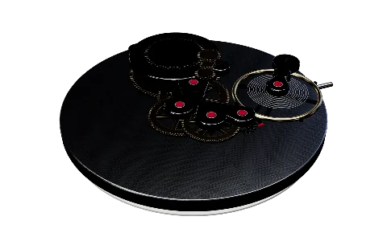
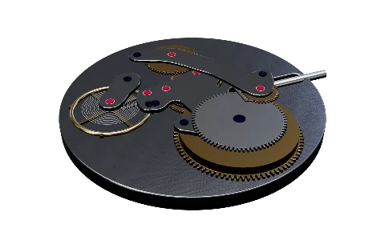
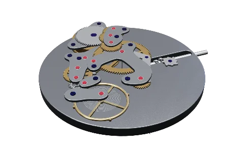
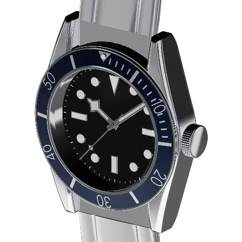
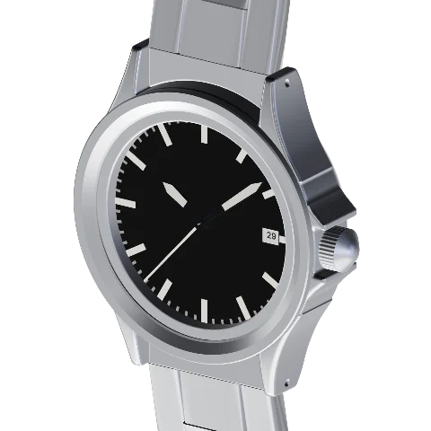
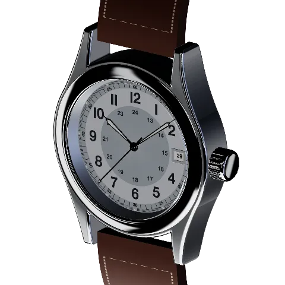
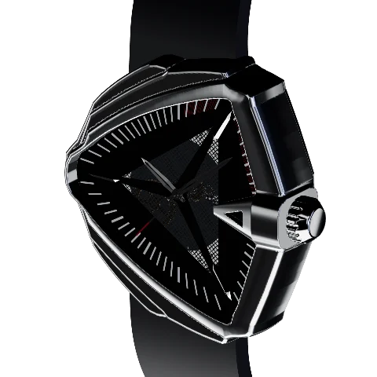
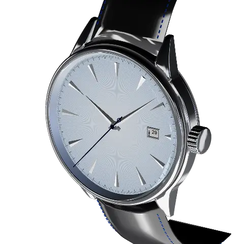
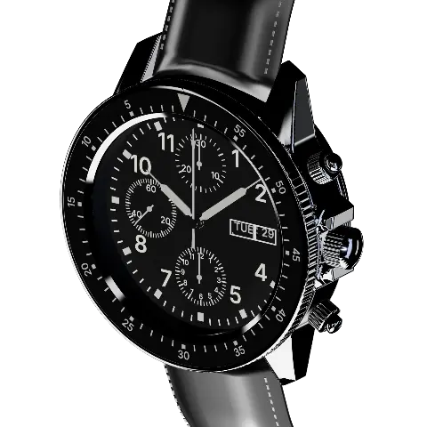

<div align="center">

# Caseback

**裏蓋の向こうで、何が起きているのか。**<br>
機械式時計のムーブメントを実寸の3Dで組み上げ、歯車を回しながら仕組みを解説するウェブサイト。

*Mechanical movements, seen through the caseback.*


  

</div>

## 特徴

- **動く仕組み** — 部品の角度は歯数比と脱進機から計算する。香箱から四番車、ガンギ車、アンクル、テンプまで、実際の噛み合いどおりに回る
- **章立てのツアー** — 「時を刻む」「針を動かす」「日付を送る」「自動で巻く」「リューズ」、7750 ではさらに「クロノグラフ」。一歩ずつカメラが部品に寄り、解説と数値を添える
- **触れるムーブメント** — 分解表示、再生速度、裏返し。リューズを引いて巻き上げ・日付・時刻合わせ、クロノグラフはプッシャーでスタート／ストップ／リセット
- **実在の時計に載せる** — 各キャリバーを実際の時計のケースに収め、公式写真と重ねて形を合わせている
- **出典つき** — すべての部品に出典を記録。公表されていない値は推定値と明示する
- **日本語／英語**、ライト／ダークテーマ、スマートフォン対応。ツアーの位置は URL で共有できる（`?lang=ja&ch=time&part=balance`）

## 収録

### キャリバー

| キャリバー | 直径 | 振動数 | 石数 | パワーリザーブ | 章 |
| --- | --- | --- | --- | --- | --- |
| ETA 2824-2 | 25.6 mm | 28,800 vph | 25 | 38 h | 時・針・日付・自動巻き・リューズ |
| Seiko NH35A | 27.4 mm | 21,600 vph | 24 | 41 h | 時・針・日付・自動巻き・リューズ |
| Valjoux 7750 | 30 mm | 28,800 vph | 25 | 48 h | 上記＋曜日・クロノグラフ |

### 時計

<table>
<tr>
<td align="center"><br><b>Tudor</b> Heritage Black Bay<br><sub>79220B · ETA 2824-2</sub></td>
<td align="center"><br><b>Sinn</b> 556 I<br><sub>556.010 · ETA 2824-2</sub></td>
<td align="center"><br><b>Hamilton</b> Khaki Field Auto<br><sub>H70455553 · H-10</sub></td>
</tr>
<tr>
<td align="center"><br><b>Hamilton</b> Ventura XXL Auto<br><sub>H24655331 · H-10</sub></td>
<td align="center"><br><b>Seiko</b> Presage Cocktail Time<br><sub>SRPB43 · 4R35</sub></td>
<td align="center"><br><b>Sinn</b> 103 St Sa<br><sub>103.061 · Valjoux 7750</sub></td>
</tr>
</table>

## 参加する

見たい時計がない、歯数が違う、解説が分かりにくい。どれも歓迎です。

- **時計をリクエストする** — 型番と写真の出典だけで十分です。[リクエストする →](../../issues/new?template=watch-request.yml)
- **推定値を確かな値にする** — メーカーが公表していない値は推定値としてサイトに表示しています。出典をご存じなら[教えてください →](../../issues/new?template=correction.yml)
- **解説文・翻訳を直す**、**時計やキャリバーを追加する** — [CONTRIBUTING.md](CONTRIBUTING.md) を参照

## はじめる

Node.js 22 以上が必要。

```sh
npm install
npm run dev        # http://localhost:5173
```

| コマンド | 内容 |
| --- | --- |
| `npm test` | Vitest（運動学・データ・形状・i18n・URL） |
| `npm run typecheck` | 型チェック |
| `npm run e2e` | Playwright フルスイート |
| `npm run e2e:quick` | 主要シナリオのみ（`@quick`）。日々の変更確認に |
| `npm run e2e:fast` | `dist/` が `src/`・`data/` より新しければビルドを省略してフルスイートを実行 |
| `npm run build` | 本番ビルド（`BASE_PATH` でベースパスを指定） |
| `npm run compare -- <brand>/<model>` | モデルと参考写真の比較画像を書き出す |
| `npm run thumbs -- <id>` | ホームのカード画像を撮り直す |

`E2E_PORT`（既定 4173）でプレビューのポートを、`E2E_WORKERS`（既定 2）で並列数を上書きできる。並行して動く別チェックアウトとポートが衝突する場合などに使う。

> [!NOTE]
> E2E は GPU の使える Chrome が必要（SwiftShader ではシーンが重すぎる）。CI では型チェック・単体テスト・ビルドのみ実行し、E2E はローカルで回す。

## 構成

| パス | 役割 |
| --- | --- |
| `data/calibers/<id>/caliber.ts` | キャリバー定義（部品・歯数・噛み合い・ツアー・出典）。読み込み時に zod で検証 |
| `data/watches/<brand>/<model>/` | 時計のメタデータと外装ビルダー |
| `src/kinematics` | 歯数比のグラフと脱進機から、各部品の角度を計算 |
| `src/geometry` | 歯車・ガンギ車・アンクル・テンプ・受けの手続き生成 |
| `src/scene` | React Three Fiber の描画・カメラ・ライティング・演出 |
| `src/tour` | ツアーの進行 |
| `src/ui` | ホーム・解説パネル・ツアーバー・ドック |
| `src/content/{ja,en}` | 文言 |

## 追加する

### キャリバー

1. `data/calibers/<id>/caliber.ts` を作り、`Caliber` を default export する
2. 出典で確認できない値は `provenance.confidence: 'estimated'` にする
3. `src/content/{ja,en}/<id>.json` に章・ステップ・部品の文言を足す
4. `npm test` で不変条件（歯数比、中心距離、翻訳の網羅）が通ることを確認する
5. `npm run thumbs -- <id>` でカード画像を書き出す

### 時計

参考写真の集め方から、写真に合わせた外装の調整、サムネイルの撮影までを [docs/adding-a-watch.md](docs/adding-a-watch.md) にまとめている。

## ライセンス

コードは [MIT](LICENSE)、`src/content/` の解説文と `public/thumbs/` の画像は [CC BY-SA 4.0](LICENSE-CONTENT)。

ブランド名とモデル名は各社の商標で、時計を特定するためだけに使っています。Caseback はどの時計メーカーとも関係がありません。
